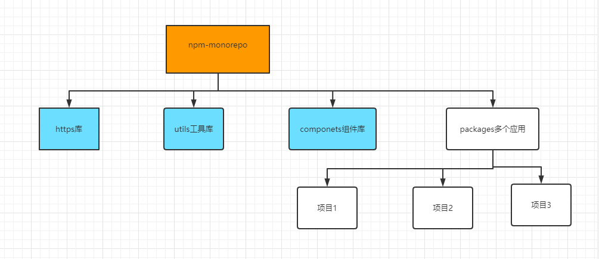

### 结构图



### doc 
- pnpm (https://pnpm.io/zh/installation)
- create-vue (https://github.com/vuejs/create-vue)
- vite (https://cn.vitejs.dev/guide/#scaffolding-your-first-vite-project)

### 从零开始搭建
 1. 文档准备
    1. pnpm init vue@naruto //vue@2.7
    2. pnpm init vue@3
```js
//创建项目
> pnpm create vue@3
//按照提示选择，pnpm-monorepo 是不需要执行的
```
## 配置pnpm-workspace.yaml
```yaml
packages:
  # all packages in direct subdirs of packages/
  - "packages/*"
  # all packages in subdirs of components/
  - "components/**"
  # 接口类
  - "apis/**"
  # 工具类
  - "utils/**"
  # exclude packages that are inside test directories
  - "!**/test/**"
```

### 创建 apis 项目
```
//进入pnpm-monorepo文件夹目录

//创建vite 基本目录
> pnpm create vite
//输入项目名称：apis
//选择 vanilla =》 vanilla-ts
```

### 创建 utils 项目
```
//进入pnpm-monorepo文件夹目录

//创建vite 基本目录
> pnpm create vite
//输入项目名称：utils
//选择 vanilla =》 vanilla-ts

```
### 创建 components 项目
```
//进入pnpm-monorepo文件夹目录

//创建vite 基本目录,组件基于vue3开发
> pnpm create vue@3

//输入项目名称：components
```

###　创建其他项目
创建 packages 文件夹，可以创建不同项目

案例：
```js
//创建 h5-client
cd packages 
pnpm create vue@3

```

### 在h5-client中使用apis,utils
首先要在apis,utils,components的package.json要配置一下入口
```json
{
  "name": "@mzmuping/components",//包名
  "version": "0.0.1",//版本
  "main": "index.ts",//入口
}
```
入口文件index.ts导出
```js
//例如：apis中index.ts
export * from "./src/user";
```

h5-client中HomeView.vue引入:
```js
import { userApi } from "@mzmuping/apis";
```
h5-client中package.json 会出现以下内容
```js
 "dependencies": {
    "@mzmuping/apis": "workspace:^0.0.1",
    "@mzmuping/components": "workspace:^0.0.1",
    "@mzmuping/utils": "workspace:^0.0.1",
  },
```
